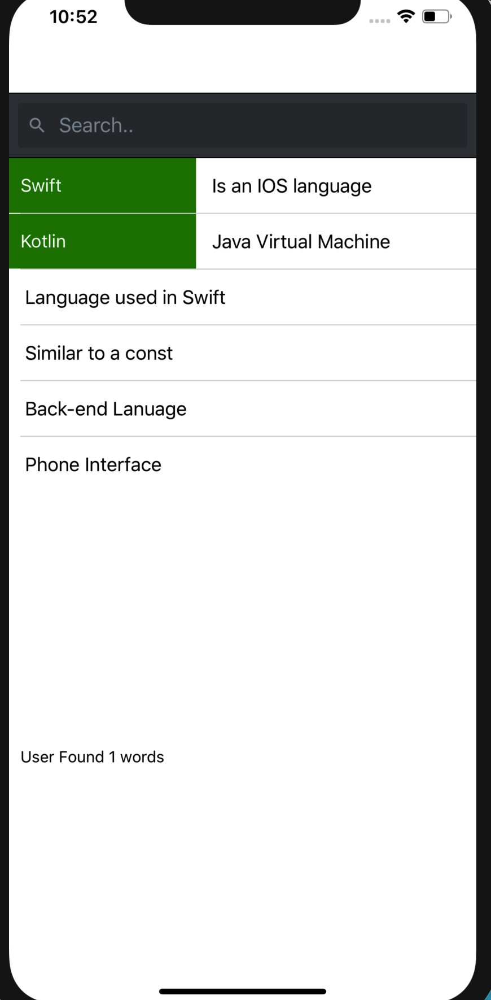

# About Search App
This is a demo App for a working search bar with filter. 

# Run
Run expo command `expo start`.

# Covered in this Repo:
- Word Filter  
- Swipe for word extra details
</img>
- Counts how many words user found: this happens when the user click on the word 
- Slick UI animation when Swiping 

 
